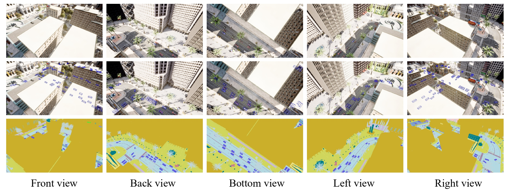

# [NeurIPS 2024] UAV3D: A Large-scale 3D Perception Benchmark for Unmanned Aerial Vehicles

### [website](https://huiyegit.github.io/UAV3D_Benchmark/) | [paper](https://arxiv.org/abs/2410.11125)

UAV3D is a public large-scale benchmark designed for 3D perception tasks from Unmanned Aerial Vehicle (UAV) platforms. This benchmark comprises the synthetic data and 3D perception algorithms, aiming to facilitate research in both single UAV and collaborative UAVs 3D perception tasks.


## News
- **(2024/9)**  The paper got accepted at NeurIPS 2024.
- **(2024/9)**  UAV3D V1.0-mini ([Google Drive](https://drive.google.com/drive/folders/1XVHjyiSrTCTAOFtILxrJp5E4tSAvWbMy?usp=share_link) or [Baidu Netdisk](https://pan.baidu.com/s/1qou0C-WXDfFpvih5OmFnVg?pwd=a6ha#list/path=%2F)) is released.
- **(2024/6)**  Source code and pre-trained models are released.
- **(2024/6)**  UAV3D V1.0 ([Google Drive](https://drive.google.com/drive/folders/1XVHjyiSrTCTAOFtILxrJp5E4tSAvWbMy?usp=share_link) or [Baidu Netdisk](https://pan.baidu.com/s/1qou0C-WXDfFpvih5OmFnVg?pwd=a6ha#list/path=%2F)) is released.


## Installation
- [Installation](./install.md)

## Prepare dataset
- [Prepare dataset](./dataset.md)


## Training and evaluation
- [Training and evaluation](./train_eval.md)


## Main Results
### 3D Object Detection (UAV3D val)


|  Model  | Backbone | Size  | mAP↑  | NDS↑  | mATE↓  | mASE↓  | mAOE↓  | Checkpoint  | Log  |
| :--: | :-------: | :--: | :--: | :--: | :--: | :--: | :--: | :--: | :--: |
| PETR | Res-50 | 704×256 |0.512|0.571|0.741|0.173|0.072| [link](https://drive.google.com/file/d/1pDLgIS-6OA6Si4yGImn8OJegF2AbNgxh/view?usp=share_link) |  [link](https://drive.google.com/file/d/1fmmWvvrl6hwi1W2me5__oVha0zYqYlvS/view?usp=share_link)  |  
|BEVFusion|Res-50|704×256 |0.487|0.458|0.615|0.152|1.000| [link](https://drive.google.com/file/d/1uu0YR-t5liOieJLAdk1AXZNt4THVKt4_/view?usp=share_link) |  [link](https://drive.google.com/file/d/1MbDSSkhctFnJ365sBuOwJEvyeacrQUjc/view?usp=share_link)  |     
|DETR3D| Res-50 | 704×256 |0.430|0.509|0.791|0.187|0.100| [link](https://drive.google.com/file/d/1DpLlBF_TGyx8_y7l2l6t3s7QUup_zTMi/view?usp=share_link) |  [link](https://drive.google.com/file/d/1UANQHSYV6d2uawqpuJCxmGdbeNQOr8mZ/view?usp=share_link)  |   
| PETR | Res-50 | 800×450 |0.581|0.632|0.625|0.160|0.064| [link](https://drive.google.com/file/d/1oEJHdoVcoGiIp50oRYzYo2JhbPgZ3KKJ/view?usp=share_link) |  [link](https://drive.google.com/file/d/1j3mfZsxnZ676bj_JqngRcgbMq9xqjWE5/view?usp=share_link)  |  
|BEVFusion|Res-101|800×450|0.536|0.582|0.521|0.154|0.343| [link](https://drive.google.com/file/d/1H48bOA6xGw6cYIitzC1yzRgnQAVEj0tO/view?usp=share_link) |  [link](https://drive.google.com/file/d/1IQjd5CDKWsAKQvJLBQcAAQy4dSfDUwez/view?usp=share_link)  |      
|DETR3D| Res-101 | 800×450|0.618|0.671|0.494|0.158|0.070| [link](https://drive.google.com/file/d/1B6V7OIcDwqOwJnrpom5dLmorMJPZQfbl/view?usp=share_link) |  [link](https://drive.google.com/file/d/1AnCHZzbEfQmehLR2U4Vlp1-0xsEhtAhZ/view?usp=share_link)  |  

### 3D Object Tracking (UAV3D val)


|  Model  | Backbone | Size  | AMOTA↑  | AMOTP↓  | MOTA↑  | MOTP↓  | TID↓  | LGD↓   | det_result  |Log  |
| :--: | :-------: | :--: | :--: | :--: | :--: | :--: | :--: | :--: | :--: | :--: |
| PETR | Res-50 | 704×256 |0.199|1.294|0.195|0.794|1.280|2.970|[link](https://drive.google.com/file/d/1J9S1v4fae_hxibFunr5jinC1-tMaN4mD/view?usp=share_link) |  [link](https://drive.google.com/file/d/1tn2B84iNh_xbHocW10hY2Z9PyOnZkKp1/view?usp=share_link)  |
|BEVFusion|Res-50|704×256 |0.566|1.137|0.501|0.695|0.790|1.600|[link](https://drive.google.com/file/d/1kxGvjVJ0vqYdEmz6KtLObB69V1qppnxb/view?usp=share_link) |  [link](https://drive.google.com/file/d/1FU95IKstfG31_aIefvYJtee_pOHhjCI3/view?usp=share_link)  |     
|DETR3D| Res-50 | 704×256 |0.089|1.382|0.121|0.800|1.540|3.530|[link](https://drive.google.com/file/d/1r8nIufMhK8v5cmsKb1rKcBGA9EbrTDRl/view?usp=share_link) |  [link](https://drive.google.com/file/d/1fxP1uivun7WS6wHFhMrOWk6ZrgU1m8pg/view?usp=share_link)  |    
| PETR | Res-50 | 800×450 |0.291|1.156|0.256|0.677|1.090|2.550|[link](https://drive.google.com/file/d/165Zm4khoLdyM7xon3HkMgGY0yNsYjOgB/view?usp=share_link) |  [link](https://drive.google.com/file/d/12CJzXVqowJ01z3NkdBcb5FQP9Lg6XjGr/view?usp=share_link)  |
|BEVFusion|Res-101|800×450|0.606|1.006|0.540|0.627|0.700|1.390|[link](https://drive.google.com/file/d/1TmTRpo29hScmOb5CSzEA5Gfw5J63WPfp/view?usp=share_link) |  [link](https://drive.google.com/file/d/1zPtCOAQ6LMwRdL8E8rTeLTHgCoxuyRGi/view?usp=share_link)  |      
|DETR3D| Res-101 | 800×450|0.262|1.123|0.238|0.561|1.140|2.720|[link](https://drive.google.com/file/d/1nCA-7OZOwBwUuxMP9yGG0HaCEr4a4pgK/view?usp=share_link) |  [link](https://drive.google.com/file/d/1O_e49NFGnY1USdev9B143TiI1klugAf4/view?usp=share_link)  |

### Collaborative 3D Object Detection (UAV3D val)


|  Model  | mAP↑  | NDS↑  | mATE↓  | mASE↓  | mAOE↓  |  AP@IoU=0.5↑  | AP@IoU=0.7↑  |Checkpoint  | Log  |
| :--: | :-------: | :--: | :--: | :--: | :--: | :--: | :--: | :--: | :--: |
|Lower-bound |0.544|0.556|0.540|0.147|0.578|0.457|0.140|[link](https://drive.google.com/file/d/1muByiSROz0vk9YLdb3K1rvlctX0yk-Nz/view?usp=share_link) |  [link](https://drive.google.com/file/d/1gjIMVmTno0ok_PbwN1V1lpdWDOgCodTd/view?usp=share_link)  |
|When2com|    0.550|0.507|0.534|0.156|0.679|0.461|0.166|[link](https://drive.google.com/file/d/1HA427BTDglHjz_R9u8kLtG86EG3emQZK/view?usp=share_link) |  [link](https://drive.google.com/file/d/1vRFqDvs0eycoKXCZhtGrsQTd9aOLM7TX/view?usp=share_link)  |
|Who2com|     0.546|0.597|0.541|0.150|0.263|0.453|0.141|[link](https://drive.google.com/file/d/1HA427BTDglHjz_R9u8kLtG86EG3emQZK/view?usp=share_link) |  [link](https://drive.google.com/file/d/1vRFqDvs0eycoKXCZhtGrsQTd9aOLM7TX/view?usp=share_link)  |
|V2VNet|      0.647|0.628|0.508|0.167|0.533|0.545|0.141|[link](https://drive.google.com/file/d/14x2PPqe4txDJioDB3zR8KTMX2ntP7L9E/view?usp=share_link) |  [link](https://drive.google.com/file/d/1sk98jB-yXY3-oQpjav4lAxFDP4m0zubx/view?usp=share_link)  |
|DiscoNet|    0.700|0.689|0.423|0.143|0.422|0.649|0.247|[link](https://drive.google.com/file/d/1soc1_kF1qO9aqEwJWKGZqiQ9KLFRywqR/view?usp=share_link) |  [link](https://drive.google.com/file/d/1lXqFlKGLLgYv19ZdwDkHCj4hZpF_IE2V/view?usp=share_link)  |
|Upper-bound| 0.720|0.748|0.391|0.106|0.117|0.673|0.316|[link](https://drive.google.com/file/d/1a159eOaqx7MesDkp1YbJU-r_v-_whbYR/view?usp=share_link) |  [link](https://drive.google.com/file/d/19YfvTPsY4zNc-kbfFBEx48APAebe_Nj9/view?usp=share_link)  |


### Collaborative 3D Object Tracking (UAV3D val)
|  Model  | AMOTA↑  | AMOTP↓  | MOTA↑  | MOTP↓  |  TID↓  |  LGD↓  |det_result  | Log  |  
| :--: | :-------: | :--: | :--: | :--: | :--: | :--: | :--: | :--:  |
|Lower-bound| 0.644|1.018|0.593|0.611|0.620|1.280|[link](https://drive.google.com/file/d/190--pUICJlqYOb3gX9XXYeI2npRF-vfv/view?usp=share_link) |  [link](https://drive.google.com/file/d/1yDn2MhndAWwMSb39dvVg6Wqwu8D7wFzI/view?usp=share_link)  |
|When2com|    0.646|1.012|0.595|0.618|0.590|1.200|[link](https://drive.google.com/file/d/1in9M8xSEw4r28l9oQ_22GkFLAMJ_4S4E/view?usp=share_link) |  [link](https://drive.google.com/file/d/1vxS-2gnQ468twiNqMFZG-msJraSxaahO/view?usp=share_link)  |
|Who2com|     0.648|1.012|0.602|0.623|0.580|1.200|[link](https://drive.google.com/file/d/1BFni14jf678aESLfe0W-HZMDvhfsl-Ac/view?usp=share_link) |  [link](https://drive.google.com/file/d/13Ysxn8nzUL_h9lpTriM-DBGUz3CeuAjV/view?usp=share_link)  |
|V2VNet|      0.782|0.803|0.735|0.587|0.360|0.710|[link](https://drive.google.com/file/d/1e1BRrOkK65jVD440UuiLjzBwA0xhpcPk/view?usp=share_link) |  [link](https://drive.google.com/file/d/13CJMbnJ8J8cnSvW1Sdse2iCTko1QzflW/view?usp=share_link)  |
|DiscoNet|    0.809|0.703|0.766|0.516|0.300|0.590|[link](https://drive.google.com/file/d/15eYDvOaK9ZT1wdrpWp9Tiv0VJBJ1HBFe/view?usp=share_link) |  [link](https://drive.google.com/file/d/1mGBG-htsuDYSiM_N3vx5JSZPspGcoPBd/view?usp=share_link)  |
|Upper-bound| 0.812|0.672|0.781|0.476|0.300|0.570|[link](https://drive.google.com/file/d/1WdPzloZd4a7j6SacO09WSSA5ZTuEvW0J/view?usp=share_link) |  [link](https://drive.google.com/file/d/13u4Z9jJ6LXoORFWCLYw76CTFg46PS1ST/view?usp=share_link)  |


## Citation
If you find this repository useful, please consider giving a star :star: and citation :blue_book::
```
@inproceedings{uav3d2024,
  title={UAV3D: A Large-scale 3D Perception Benchmark for Unmanned Aerial Vehicles},
  author={Hui Ye and Raj Sunderraman and Shihao Ji},
  booktitle={The 38th Conference on Neural Information Processing Systems (NeurIPS)},
  year={2024}
}
```

## Acknowledgement

In collecting UAV3D, we received valuable help and suggestions from the authors of [CoPerception-UAV](https://siheng-chen.github.io/dataset/coperception-uav/) and [Where2comm](https://arxiv.org/abs/2209.12836).

For 3D object detection task, our implementation is based on [PETR](https://github.com/megvii-research/PETR/tree/main), [BEVFusion](https://github.com/mit-han-lab/bevfusion), and [DETR3D](https://github.com/WangYueFt/detr3d).

For Collaborative 3D object detection task, our implementation is based on [BEVFusion](https://github.com/mit-han-lab/bevfusion) and [CoPerception](https://github.com/coperception/coperception?tab=readme-ov-file).

For object tracking task, our implementation is based on [CenterPoint](https://github.com/tianweiy/CenterPoint).

The software and data were created by Georgia State University Research Foundation under Army Research Laboratory (ARL) Award Numbers W911NF-22-2-0025 and W911NF-23-2-0224. ARL, as the Federal awarding agency, reserves a royalty-free, nonexclusive and irrevocable right to reproduce, publish, or otherwise use this software for Federal purposes, and to authorize others to do so in accordance with 2 CFR 200.315(b).

